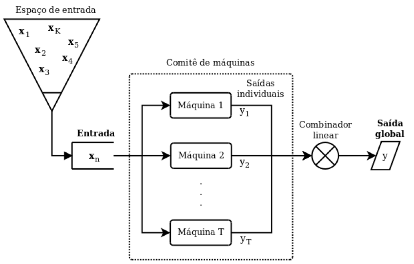

# Seleção/Ponderação de Modelos de Classificação pela Análise Hierárquica de Processos

**Diversidade** é um tema essencial em Aprendizado de Máquina. 

Cada algoritmo aprende modelos diferentes sobre uma mesma base de dados, devido à:

*   Parâmetros aleatórios de inicialização
*   Amostras diferentes selecionadas para aprendizados
*   Atributos diferentes utilizados
*   Estrutura interna do algoritmo

Para aproveitar o melhor de cada modelo recorre-se a técnica de Comitê de Máquinas (Ensemble).

O vídeo-tutorial está disponível em: https://youtu.be/fxa29bcx-fc

**#1 Diversidade dos Modelos**

Há três principais razões pelas quais o Ensemble é melhor que os modelos individuais [1] em certas circunstâncias:

1.   <u>Estatística:</u> os algoritmos têm por princípio a procura de uma determinada hipótese $h$ que explique o relacionamento das amostras de entrada e saída, em um espaço de hipóteses $H$. Quando as amostras fornecidas não são sufientes para obter uma boa hipótese, o algoritmo pode convergir para hipóteses distintas sendo que cada uma delas fornece sua própria acurácia. Mesmo que eslas tenham acurácias próximas, isso não significa que os modelos classificam na mesma classe um mesmo exemplo, mas que distintos máquinas (modelos) erram e acertam aproximadamente a mesma quantidade de vezes. É neste sentido que, ao implementar um comitê de máquinas, atenua-se as predições errôneas, exceto quando a maior parte das modelos falham.

2.   <u>Computacional:</u> Visto que o espaço de hipóteses $H$ é amplo, os algoritmos tendem à soluções locais dos problemas, ou seja, é comum que os algoritmos convirjam para mínimos (máximos) locais. Assim, dependendo de condições iniciais de inicialização os mesmos algoritmos podem convergir para soluções distintas, sem garantia que seja a solução ótima do espaço de hipóteses $H$. Logo, a agregação de vários modelos supera os resultados de uma máquina solitária, porque algumas delas podem convergir para pontos extremos locais que estão mais próximos dos globais do que outros modelos, melhorando então as predições.

3.   <u>Representativa:</u> Muitos algoritmos de aprendizado de máquina possuem uma limitação implícita em relação ao espaço de hipóteses tangível, logo eles somente têm a capacidade de estimar funções dentro de um subconjunto do espaço de hipóteses $H$. Este é o caso daqueles algoritmos que somente podem separar classes linearmente separáveis. Desta maneira, ao combinar diferentes máquinas, que utilizam distintos subconjuntos do espaço de hipóteses para suas buscas, melhora-se a capacidade de predição global.

**#2 Subespaço de atributos**

- Um outro contexto onde a utilização do comitê de máquinas é necessária, é quando o conjunto de atributos pode ser agrupado por <u>características similares</u>. 

- Ou quando o custo computacional para treinar modeloes em bases de dados com centenas de milhares de atributos (<u>big data</u>) se torna inviável, devido ao consumo de memória excessivo.

Isso pode ser evitado, particionando o espaço de atributos.

Por exemplo, o tratamento de um paciente pode ser decidido analisando exames de sangue, de imagem, ultrasons, dentre outros. 

Assim, cada modelo pode se especializar em um determinado subespaço de atributos.

